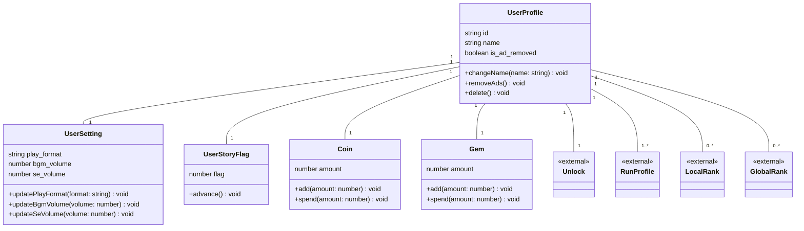

# 01 ユーザー ドメインモデル

プレイヤーの永続データ（プロフィール・設定・所持通貨・ストーリー進行）を扱う領域です。
`Unlock` / `RunProfile` / `LocalRank` / `GlobalRank` はこの領域の外側（それぞれ `02-unlock.md` / `03-run.md` / `05-local-rank.md` / `06-global-rank.md`）で詳細を定義するため、ここでは空で参照しています。

