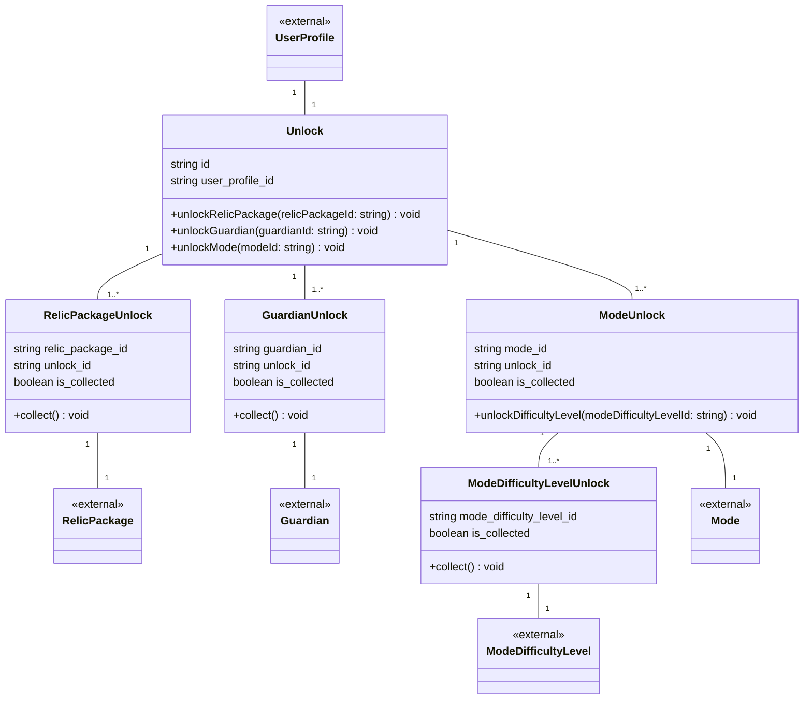

# 02 解放 ドメインモデル

遺物パッケージ / ガーディアン / モード / モード難易度の解放状況を扱う。
`Unlock` はユーザーごとに1つ存在するアグリゲートルートとし、各 `*Unlock` の生成・整合性を担う。
`is_collected` は各 `*Unlock` 共通で「購入・解放が完了したか」を表す。

## 未確定事項

- `ModeUnlock.is_collected` を持たせるか？（本ファイルにはあり、overview.md には無い）
  - A:
