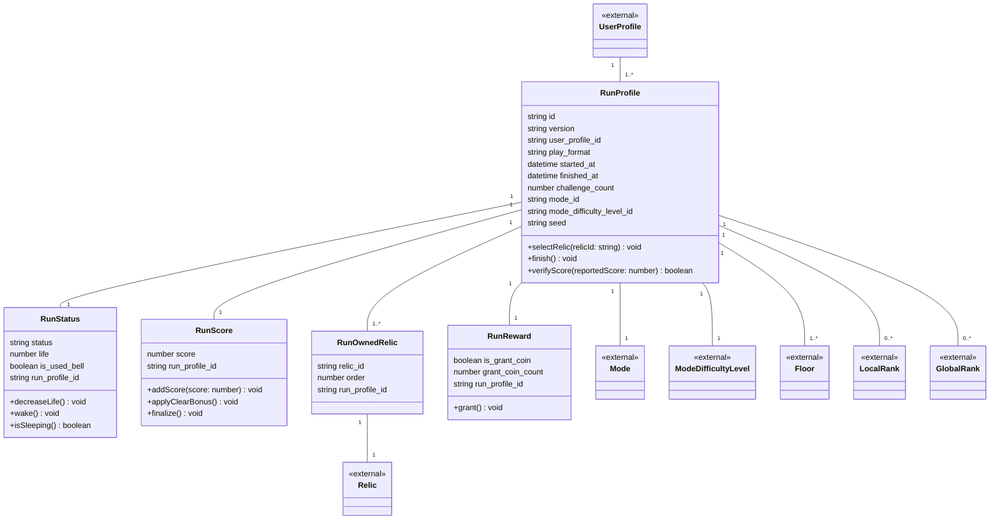

# 03 ラン ドメインモデル

1回のラン（進行状態・スコア・所持遺物）を扱う。スコア検証（`verifyScore`）は `RunProfile` が担う。

```mermaid

classDiagram

class RunProfile {
    string id
    string version
    string user_profile_id
    string play_format
    datetime started_at
    datetime finished_at
    number challenge_count
    string mode_id
    string mode_difficulty_level_id
    string seed
    +selectRelic(relicId: string) void
    +finish() void
    +verifyScore(reportedScore: number) boolean
}

class RunStatus {
    string status
    number life
    boolean is_used_bell
    string run_profile_id
    +decreaseLife() void
    +wake() void
    +isSleeping() boolean
}

class RunScore {
    number score
    string run_profile_id
    +addScore(score: number) void
    +applyClearBonus() void
    +finalize() void
}

class RunOwnedRelic {
    string relic_id
    number order
    string run_profile_id
}

class RunReward {
    boolean is_grant_coin
    number grant_coin_count
    string run_profile_id
    +grant() void
}

%% 外部（01-user.md）
class UserProfile {
    <<external>>
}

%% 外部（07-mode.md）
class Mode {
    <<external>>
}
class ModeDifficultyLevel {
    <<external>>
}

%% 外部（04-floor.md）
class Floor {
    <<external>>
}

%% 外部（05-local-rank.md）
class LocalRank {
    <<external>>
}

%% 外部（06-global-rank.md）
class GlobalRank {
    <<external>>
}

%% 外部（08-relic.md）
class Relic {
    <<external>>
}

UserProfile "1" -- "1..*" RunProfile
RunProfile "1" -- "1" RunStatus
RunProfile "1" -- "1" RunScore
RunProfile "1" -- "1..*" RunOwnedRelic
RunProfile "1" -- "1" RunReward
RunProfile "1" -- "1..*" Floor
RunProfile "1" -- "0..*" LocalRank
RunProfile "1" -- "0..*" GlobalRank
RunProfile "1" -- "1" Mode
RunProfile "1" -- "1" ModeDifficultyLevel
RunOwnedRelic "1" -- "1" Relic

```
