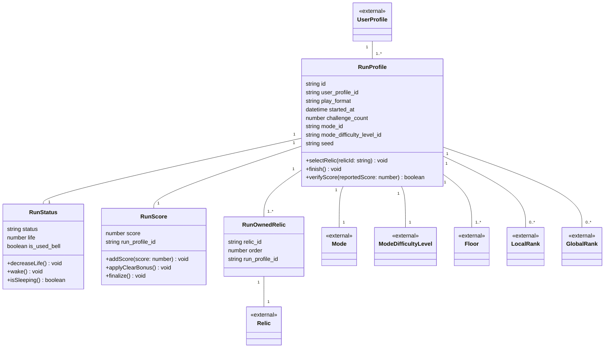

# 03 ラン ドメインモデル

1回のプレイ（ラン）の進行状態・スコア・所持遺物を扱う領域です。
`04-game.md`の「シードからランを再現してスコアを検証する」仕組みに合わせて、`RunProfile`に検証用のメソッドを置いています。

## メモ

- `RunProfile → Mode` / `RunProfile → ModeDifficultyLevel`の関係線は、overview.mdの相関図には無かったものをここで補っています（`mode_id` / `mode_difficulty_level_id`がFKとして存在するため）。意図的に省略されていたのであれば戻してください。
- `RunProfile.mode_id` / `mode_difficulty_level_id`は`Mode.id` / `ModeDifficultyLevel.id`と同じ`string`型に揃えました（以前指摘した型不一致は解消済みです）。
- `RunOwnedRelic`は取得順序を記録するだけの記録用エンティティと判断し、固有のメソッドは置いていません。
