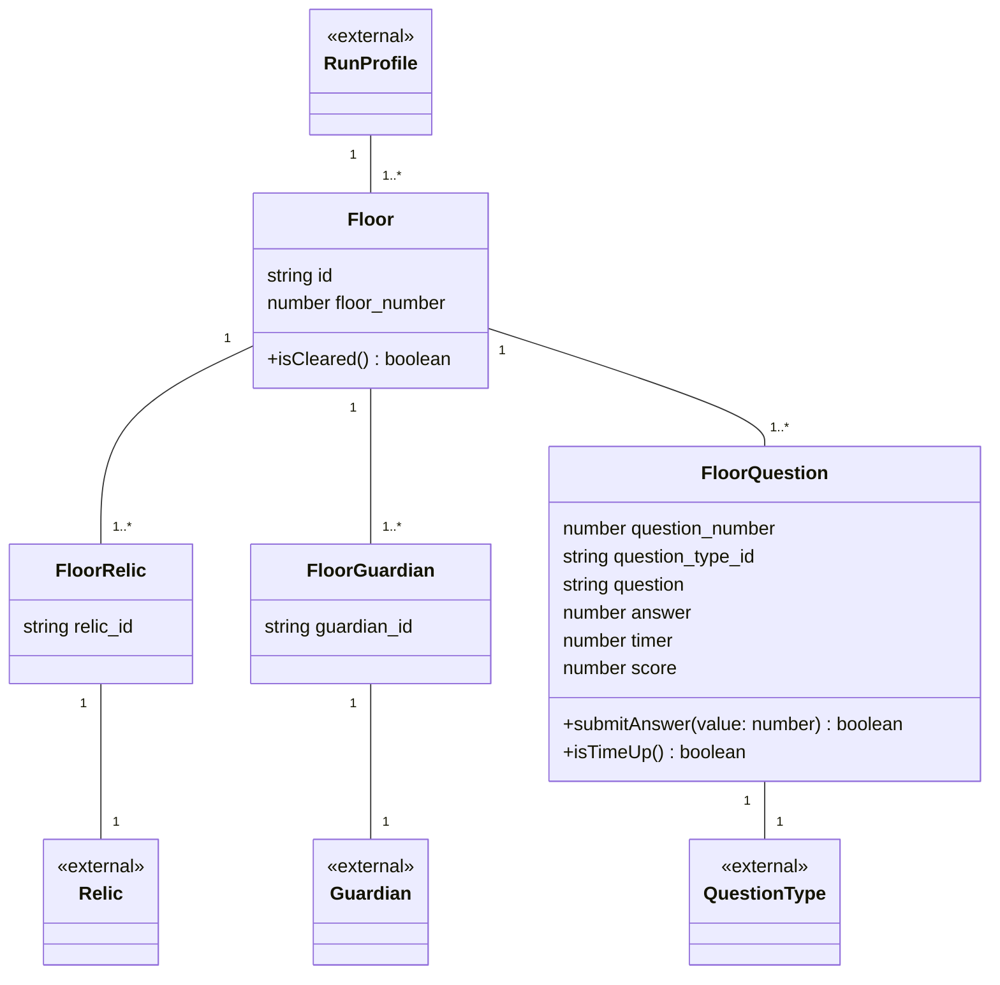

# 04 フロア ドメインモデル

1つの段階（フロア）における、提示される遺物候補・登場するガーディアン・出題される問題を扱う領域です。

## メモ

- `FloorQuestion`の解答メソッドは`answer`という名前にすると既存の属性`answer`（正答）と衝突するため、`submitAnswer(value)`という名前にしています。
- `FloorRelic` / `FloorGuardian`は提示候補・登場記録そのものであり、状態を持つ属性が無いため固有のメソッドは置いていません。
