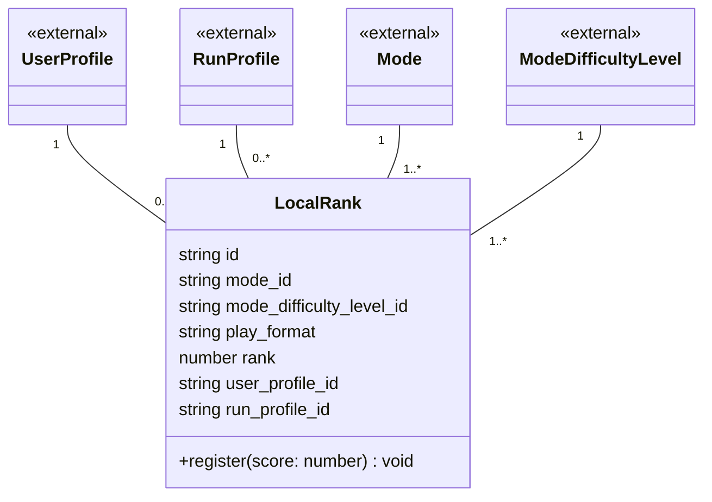

# 05 ローカルランク ドメインモデル

ボード（モード×難易度×プレイ形式）ごとの、ユーザー自身のスコア上位5件（`06-leaderboard.md`のローカルランキング）を構成する記録を扱う領域です。
ランが終わるたびに1件追加される、追記型の履歴データとして扱っています。

## メモ

- `06-global-rank.md`の`GlobalRank`とは別領域として分けています。`LocalRank`はラン単位で追記され続ける履歴データ、`GlobalRank`はユーザー×ボードで1件だけを保持し上書きされる現在値データという、更新のされ方が異なるためです。
