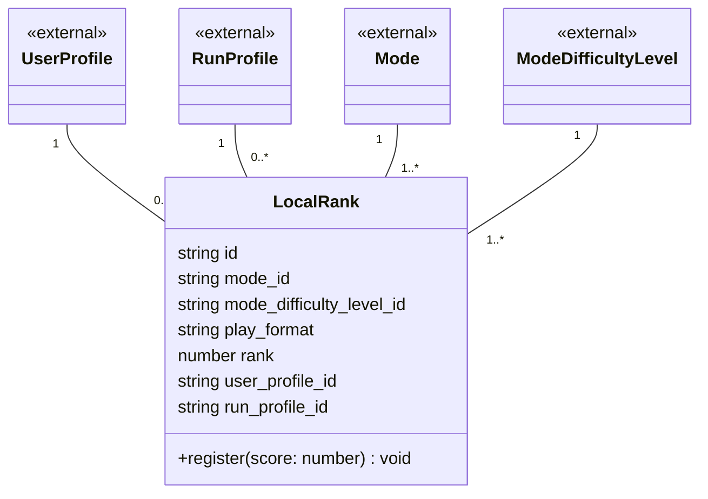

# 05 ローカルランク ドメインモデル

ボードごとの自分のスコア上位5件（ローカルランキング）を扱う。ランが終わるたびに1件追記する履歴データとする。

```mermaid

classDiagram

class LocalRank {
    string id
    string mode_id
    string mode_difficulty_level_id
    string play_format
    number rank
    string user_profile_id
    string run_profile_id
    +register(score: number) void
}

%% 外部（01-user.md）
class UserProfile {
    <<external>>
}

%% 外部（03-run.md）
class RunProfile {
    <<external>>
}

%% 外部（07-mode.md）
class Mode {
    <<external>>
}
class ModeDifficultyLevel {
    <<external>>
}

UserProfile "1" -- "0..*" LocalRank
RunProfile "1" -- "0..*" LocalRank
Mode "1" -- "1..*" LocalRank
ModeDifficultyLevel "1" -- "1..*" LocalRank

```

## 未確定事項

- 順位付けに使うスコアを `LocalRank` の属性として持たせるか？（現状 `rank` のみで `score` が無い）
  - A:
