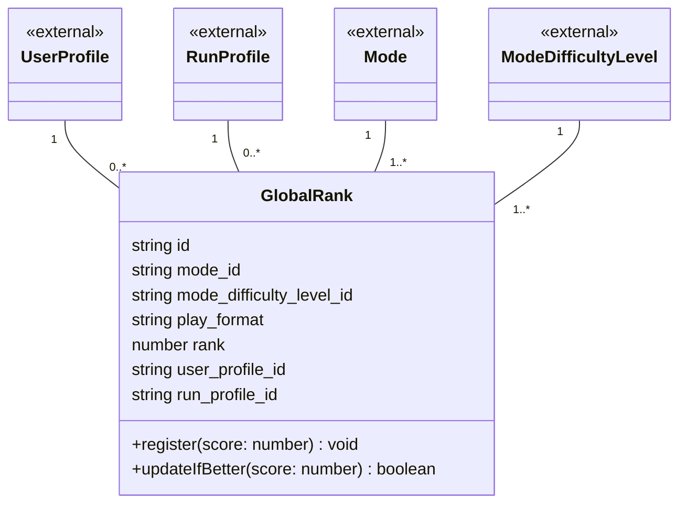

# 06 グローバルランク ドメインモデル

ボード（モード×難易度×プレイ形式）ごとの、世界の上位100件と自分の現在順位（`06-leaderboard.md`のグローバルランキング）を構成する記録を扱う領域です。
ユーザー×ボードにつき1件だけを保持し、より良いスコアが出るたびに上書きする、現在値のスナップショットとして扱っています。

## メモ

- `updateIfBetter()`は、新しいスコアが既存の`GlobalRank.rank`が参照するスコアを上回った場合だけ更新する、という運用ルールを表すメソッドです。
- 「ユーザー×モード×難易度×プレイ形式につき1件」という一意制約はER図上には表現していませんが、`GlobalRank`の中核となる不変条件です。
