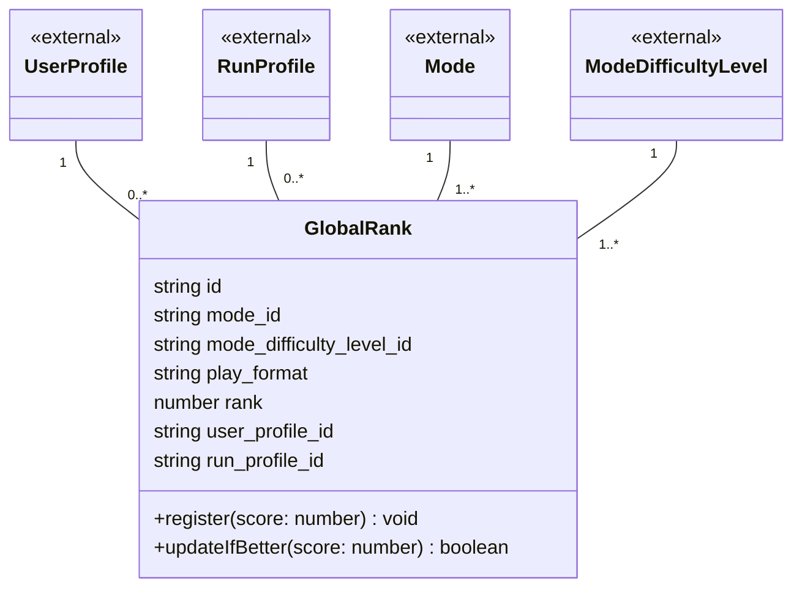

# 06 グローバルランク ドメインモデル

ボードごとの世界の上位100件と自分の現在順位（グローバルランキング）を扱う。
ユーザー × ボードにつき1件だけ保持し、より良いスコアが出たとき（`updateIfBetter`）だけ上書きする。

## 未確定事項

- 順位付けに使うスコアを `GlobalRank` の属性として持たせるか？（現状 `rank` のみで `score` が無い）
  - A:
