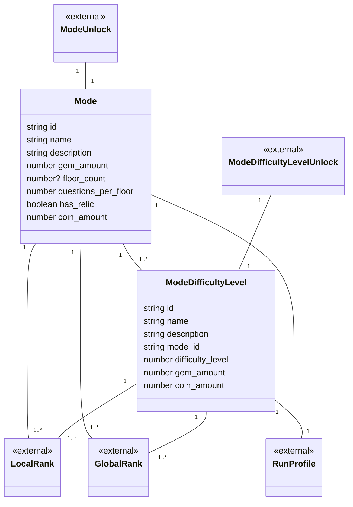

# 07 モード ドメインモデル

モード・モード難易度のマスターデータを扱う。解放コストを使った判定は `02-unlock.md` の `Unlock.unlockMode` / `ModeUnlock.unlockDifficultyLevel` が担う。

```mermaid

classDiagram

class Mode {
    string id
    string name
    string description
    number gem_amount
    number? floor_count
    number questions_per_floor
    boolean has_relic
    number coin_amount
}

class ModeDifficultyLevel {
    string id
    string name
    string description
    string mode_id
    number difficulty_level
    number gem_amount
    number coin_amount
}

%% 外部（02-unlock.md）
class ModeUnlock {
    <<external>>
}
class ModeDifficultyLevelUnlock {
    <<external>>
}

%% 外部（05-local-rank.md）
class LocalRank {
    <<external>>
}

%% 外部（06-global-rank.md）
class GlobalRank {
    <<external>>
}

%% 外部（03-run.md）
class RunProfile {
    <<external>>
}

Mode "1" -- "1..*" ModeDifficultyLevel
ModeUnlock "1" -- "1" Mode
ModeDifficultyLevelUnlock "1" -- "1" ModeDifficultyLevel
Mode "1" -- "1..*" LocalRank
ModeDifficultyLevel "1" -- "1..*" LocalRank
Mode "1" -- "1..*" GlobalRank
ModeDifficultyLevel "1" -- "1..*" GlobalRank
Mode "1" -- "1" RunProfile
ModeDifficultyLevel "1" -- "1" RunProfile

```
