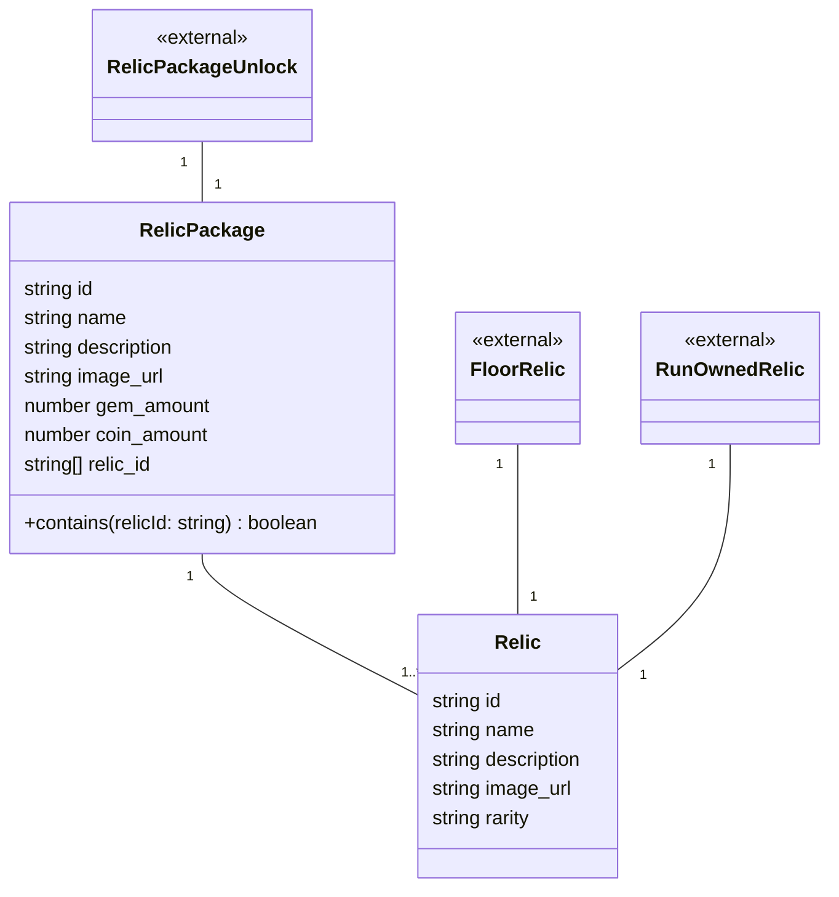

# 08 遺物 ドメインモデル

遺物・遺物パッケージのマスターデータを扱う。

```mermaid

classDiagram

class RelicPackage {
    string id
    string name
    string description
    string image_url
    number gem_amount
    number coin_amount
    string[] relic_id
    +contains(relicId: string) boolean
}

class Relic {
    string id
    string name
    string description
    string image_url
    string rarity
}

%% 外部（02-unlock.md）
class RelicPackageUnlock {
    <<external>>
}

%% 外部（04-floor.md）
class FloorRelic {
    <<external>>
}

%% 外部（03-run.md）
class RunOwnedRelic {
    <<external>>
}

RelicPackageUnlock "1" -- "1" RelicPackage
RelicPackage "1" -- "1..*" Relic
FloorRelic "1" -- "1" Relic
RunOwnedRelic "1" -- "1" Relic

```

## 未確定事項

- 遺物の効果（効果の種別・効果値）をどの属性・メソッドで表すか？
  - A:
