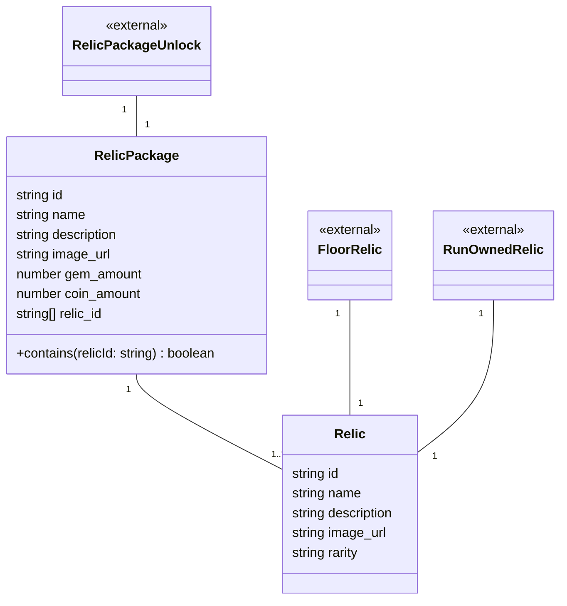

# 08 遺物 ドメインモデル

遺物・遺物パッケージのマスターデータを扱う領域です。

## メモ

- `Relic`の効果（`requirements-definition.md` 2.4.2 の効果種別）は現状のドメインモデルに実装用の属性が無く、仕様側も「未定」寄りの記載なので、ここではメソッドを追加していません。効果ロジックが固まったら別途検討が必要です。
- `RelicPackage.contains()`は`relic_id`配列に対する参照用の軽いメソッドとして追加しました。
