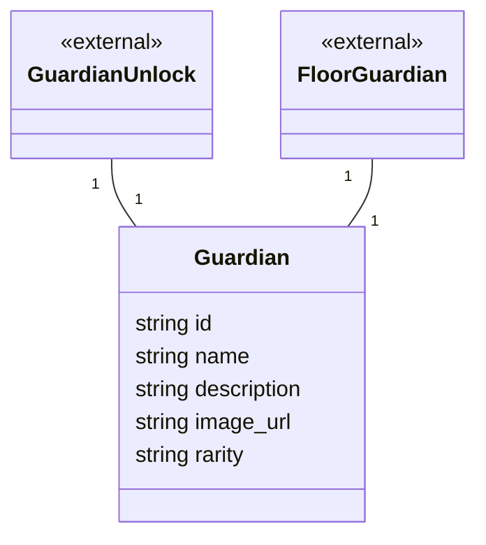

# 09 ガーディアン ドメインモデル

ガーディアンのマスターデータを扱う。

```mermaid

classDiagram

class Guardian {
    string id
    string name
    string description
    string image_url
    string rarity
}

%% 外部（02-unlock.md）
class GuardianUnlock {
    <<external>>
}

%% 外部（04-floor.md）
class FloorGuardian {
    <<external>>
}

GuardianUnlock "1" -- "1" Guardian
FloorGuardian "1" -- "1" Guardian

```

## 未確定事項

- ガーディアンの能力（`Ability`）をどの属性・メソッドで表すか？
  - A:
