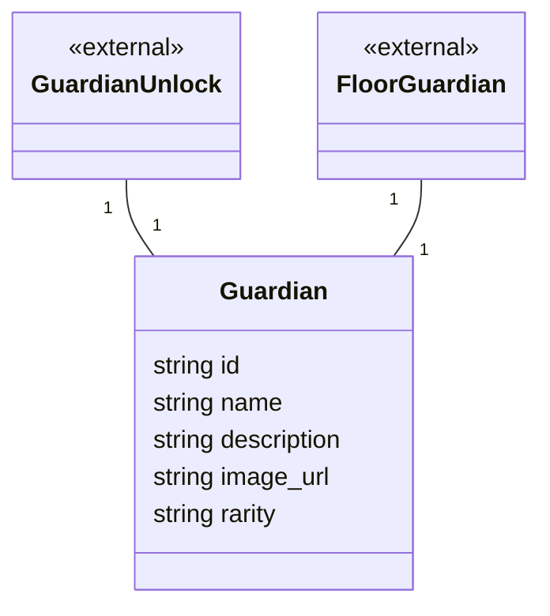

# 09 ガーディアン ドメインモデル

ガーディアンのマスターデータを扱う領域です。

## メモ

- 以前指摘していた`Enemy`とユビキタス言語`Guardian`の表記ゆれは解消済みです（`EnemyUnlock`→`GuardianUnlock`、`FloorEnemy`→`FloorGuardian`も合わせてリネーム）。
- ガーディアンの「能力（`Ability`）」（ユビキタス言語6章）に対応する属性が無いため、能力に関するメソッドは追加していません。
