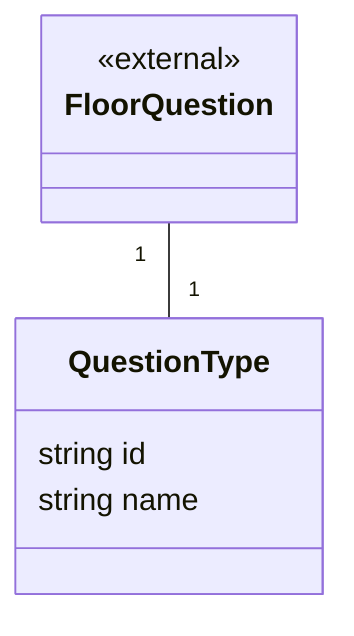

# 10 問題 ドメインモデル

問題種別のマスターデータを扱う。出題内容・正誤判定は `04-floor.md` の `FloorQuestion` が担う。

```mermaid

classDiagram

class QuestionType {
    string id
    string name
}

%% 外部（04-floor.md）
class FloorQuestion {
    <<external>>
}

FloorQuestion "1" -- "1" QuestionType

```
