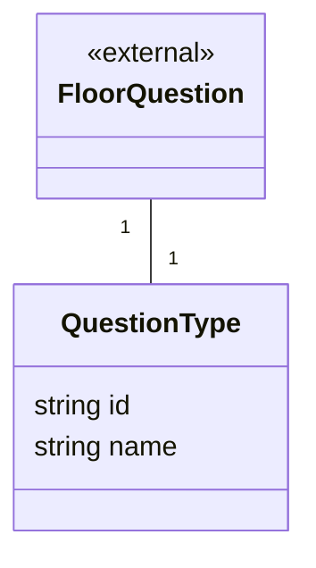

# 10 問題 ドメインモデル

問題種別のマスターデータを扱う領域です。

```mermaid

classDiagram

class QuestionType {
    string id
    string name
}

%% 外部（04-floor.md）
class FloorQuestion {
    <<external>>
}

FloorQuestion "1" -- "1" QuestionType

```

## メモ

- `QuestionType`は種別名だけを持つ定義値のため、メソッドは追加していません。実際の出題内容・正誤判定は`04-floor.md`の`FloorQuestion`側に置いています。
