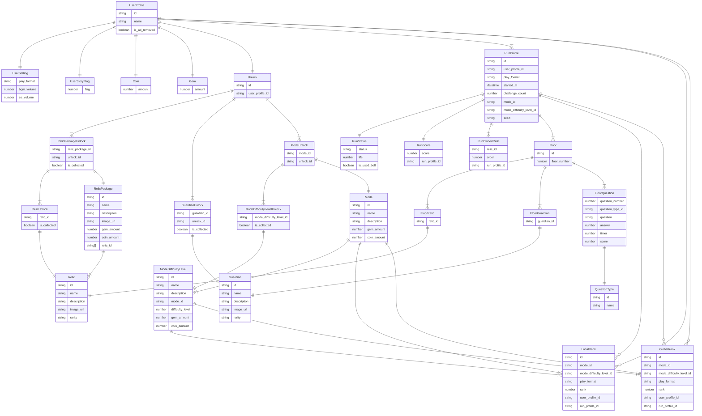

# ドメインモデル　全体像

ドメインモデルの全体像をmermaidを利用してまとめています。
ドメインモデル専用のモデルがないため、ERDiagramで代用しています
EntityとValueObjectの名前とそこに属する属性のみでまとめています。メソッドはまとめていないです。

```mermaid

erDiagram

%% User
UserProfile {
    string id
    string name
    boolean is_ad_removed
}

UserSetting {
    string play_format
    number bgm_volume
    number se_volume
}

UserStoryFlag {
    number flag
}

Coin {
    number amount
}

Gem {
    number amount
}

%% Unlock
Unlock {
    string id
    string user_profile_id
}

RelicPackageUnlock {
    string relic_package_id
    string unlock_id
    boolean is_collected
}

RelicUnlock {
    string relic_id
    boolean is_collected
}

GuardianUnlock {
    string guardian_id
    string unlock_id
    boolean is_collected
}

ModeUnlock {
    string mode_id
    string unlock_id
}

ModeDifficultyLevelUnlock {
    string mode_difficulty_level_id
    boolean is_collected
}

%% Run
RunProfile {
    string id
    string user_profile_id
    string play_format
    datetime started_at
    number challenge_count
    string mode_id
    string mode_difficulty_level_id
    string seed
}

RunStatus {
    string status
    number life
    boolean is_used_bell
}

RunScore {
    number score
    string run_profile_id
}

RunOwnedRelic {
    string relic_id
    number order
    string run_profile_id
}

%% Floor
Floor {
    string id
    number floor_number
}

FloorRelic {
    string relic_id
}

FloorGuardian {
    string guardian_id
}

FloorQuestion {
    number question_number
    string question_type_id
    string question
    number answer
    number timer
    number score
}

%% LocalRank
LocalRank {
    string id
    string mode_id
    string mode_difficulty_level_id
    string play_format
    number rank
    string user_profile_id
    string run_profile_id
}

%% GlobalRank

GlobalRank {
    string id
    string mode_id
    string mode_difficulty_level_id
    string play_format
    number rank
    string user_profile_id
    string run_profile_id
}

%% Mode
Mode {
    string id
    string name
    string description
    number gem_amount
    number coin_amount
}

ModeDifficultyLevel {
    string id
    string name
    string description
    string mode_id
    number difficulty_level
    number gem_amount
    number coin_amount
}

%% Relic
RelicPackage {
    string id
    string name
    string description
    string image_url
    number gem_amount
    number coin_amount
    string[] relic_id
}

Relic {
    string id
    string name
    string description
    string image_url
    string rarity
}

%% Guardian
Guardian {
    string id
    string name
    string description
    string image_url
    string rarity
}

%% Question
QuestionType {
    string id
    string name
}

%% 相関図
UserProfile ||--|| UserSetting: ""
UserProfile ||--|| UserStoryFlag: ""
UserProfile ||--|| Coin: ""
UserProfile ||--|| Gem: ""

UserProfile ||--|| Unlock: ""
Unlock ||--|{ RelicPackageUnlock: ""
RelicPackageUnlock ||--|{ RelicUnlock: ""
Unlock ||--|{ GuardianUnlock: ""
Unlock ||--|{ ModeUnlock: ""
ModeUnlock ||--|{ ModeDifficultyLevelUnlock: ""

RelicPackageUnlock ||--|| RelicPackage: ""
RelicPackage ||--|{ Relic: ""
RelicUnlock ||--|| Relic: ""

GuardianUnlock ||--|| Guardian: ""

ModeUnlock ||--|| Mode: ""
ModeDifficultyLevelUnlock ||--|| ModeDifficultyLevel: ""
Mode ||--|{ ModeDifficultyLevel: ""

UserProfile ||--|{ RunProfile: ""
RunProfile ||--|| RunStatus: ""
RunProfile ||--|| RunScore: ""
RunProfile ||--|{ RunOwnedRelic: ""

RunProfile ||--|{ Floor: ""
Floor ||--|{ FloorRelic: ""
Floor ||--|{ FloorGuardian: ""
Floor ||--|{ FloorQuestion: ""

FloorGuardian ||--|| Guardian: ""
FloorRelic ||--|| Relic: ""
FloorQuestion ||--|| QuestionType: ""

UserProfile ||--o{ LocalRank: ""
RunProfile ||--o{ LocalRank: ""
Mode ||--|{ LocalRank: ""
ModeDifficultyLevel ||--|{ LocalRank: ""

UserProfile ||--o{ GlobalRank: ""
RunProfile ||--o{ GlobalRank: ""
Mode ||--|{ GlobalRank: ""
ModeDifficultyLevel ||--|{ GlobalRank: ""
```
