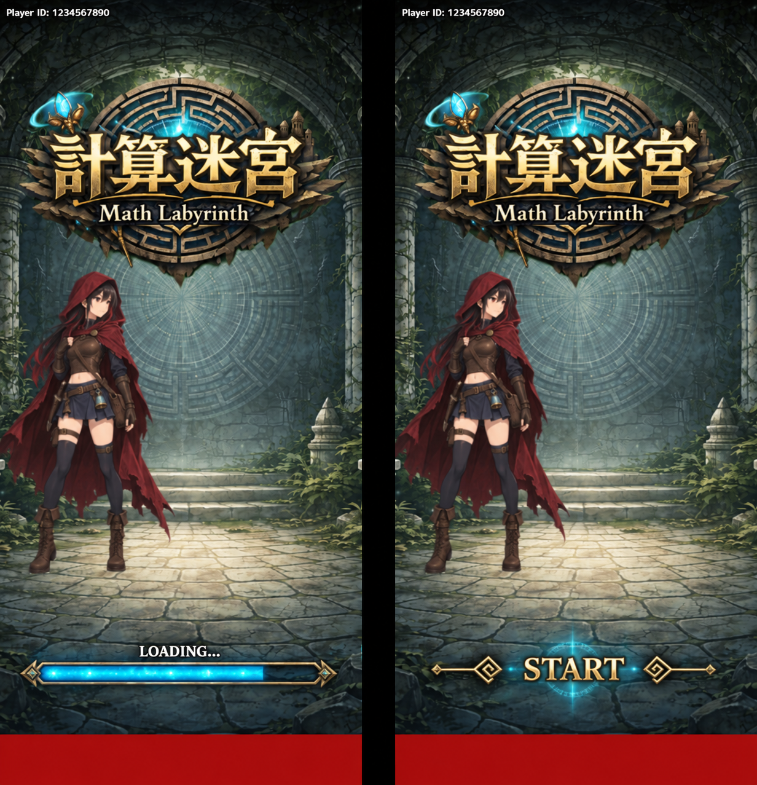
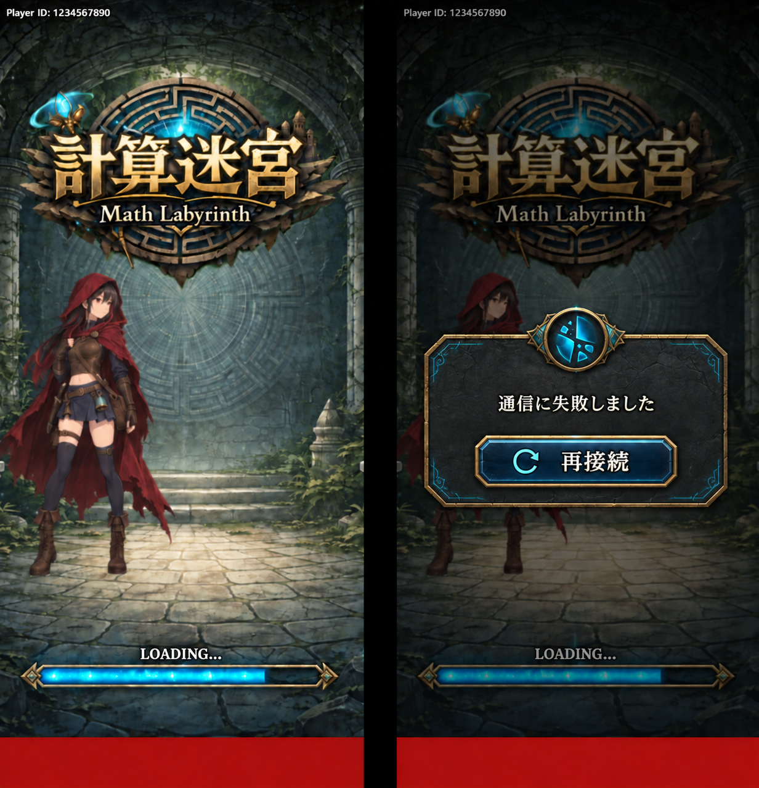

# 01 タイトル画面(title)

※画像はあくまでもイメージです。

## 1. 概要
- ユーザーのサイレントログインを行う
- ユーザーIDの確認ができる
- ゲームの根幹となるマスターデータのダウンロードを行う

## 2. ユースケース
| ユースケース | アクター | トリガー | 処理 |
| ----------- | ------- | ------- | ---- |
| サイレントログインをする　| システム | アプリを起動する | 端末に保存をしている認証情報を基にサイレントログインをする その後、ユーザーデータを取得する |
| マスターデータの取得をする | システム | アプリを起動する | サーバー側にあるデータを取得する |

## 3. 画面遷移
| 操作 | 遷移先 |
| ---- | ----- |
| スタートボタンをタップ | スタートメニュー画面 |

## 4. 取得要素

| 要素 | 内容 | 取得条件 |
| --- | --- | --- |
| ユーザーID | プレイヤーに紐づくユニークなID。問い合わせの際に利用する | サイレントログイン時 |
| ユーザーデータ | コイン・ジェム・解放状況・図鑑・ベストスコアなど、プレイヤーに紐づくデータ | サイレントログイン後 |
| マスターデータ | 遺物・ガーディアン・難易度・スコアの各項目の値 | アプリ起動時 |

## 5. 送信要素
| 要素 | 内容 | 送信条件 |
| ---- | ---- | ------- |
| なし

## 6. 例外処理
| 条件 | システムの対応 |
| ---- | ------------ |
| 通信に失敗した | エラーモーダルを表示、再接続を促す |

## 7. 細かな仕様
### サイレントログインについて
- サイレントログインは初回と２回目以降で処理が変わる
- 初回はアカウントがないので匿名アカウントを新しく作成される。認証情報が端末に保存される。
- 2回目以降は保存された認証情報を基にトークンを発行する

### ログインやマスターデータの取得について
- タイトル画面でのログインやマスターデータの取得は起動時のみ取得
- スタートメニュー画面からタイトル画面に戻ってきた場合はスタートボタンを表示する

### ログイン時に取得するデータについて
- ログイン時に取得するデータは以下
    - ユーザー情報（名前、コイン、ジェム）
    - ユーザーのモード・難易度の開放状況
    - ユーザーのガーディアン・遺物の解放済みIDリスト
    - ユーザーの所持レリックパックリスト
    - ゲームモード
    - ゲーム難易度
    - 遺物一覧
    - ガーディアン一覧
    - 問題形式一覧

## スタートボタンの表示
- サイレントログインが完了し、全てのマスターデータを取得したら、スタートボタンが表示される