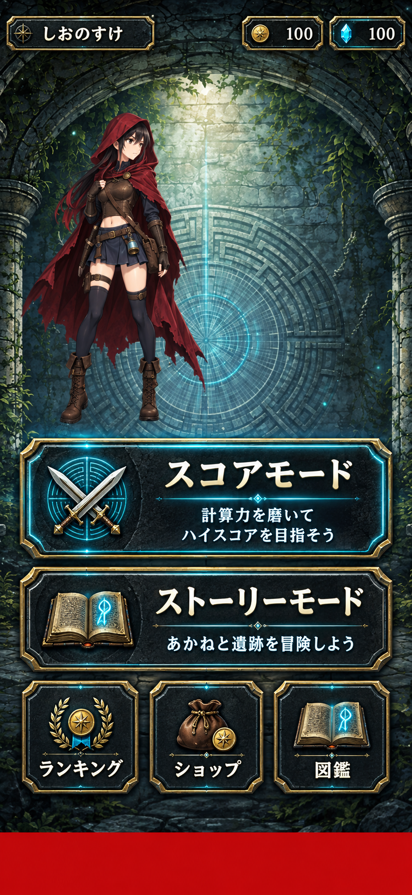
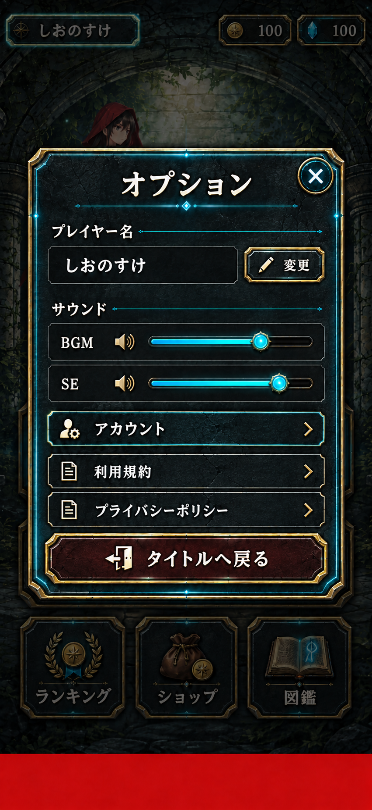
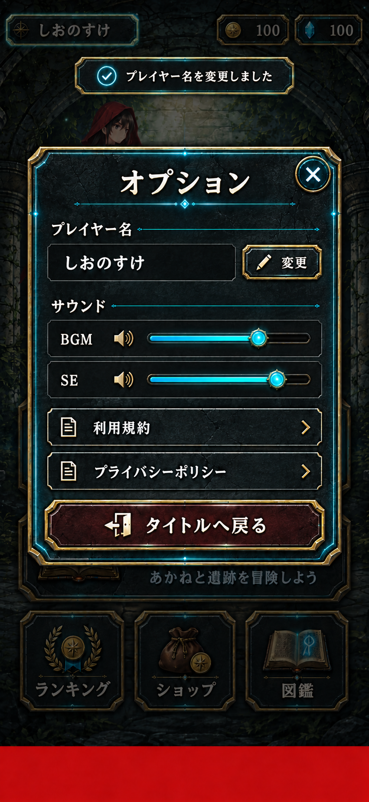

# 02 スタートメニュー画面(start-menu)

※画像はイメージ。

## 1. 概要
- 各メニューへの入り口。オプションモーダルで名前・音量を変更する

## 2. ユースケース
| ユースケース | アクター | トリガー | 処理 |
| ----------- | ------- | ------- | ---- |
| オプションを開く | ユーザー | 名前表示部分をタップする | オプションモーダルを開く |
| 名前変更アラートを表示する | ユーザー | オプションモーダルの名前変更ボタンをタップ | 名前を入力するアラートを表示する |
| 名前を変更する | ユーザー | 名前変更アラートに名前を入力して決定をタップ | 表示名を更新する |
| BGMの音量を変更する | ユーザー | オプションモーダルのBGMの音量を操作する | BGMの音量を更新する |
| SEの音量を変更する | ユーザー | オプションモーダルのSEの音量を操作する | SEの音量を更新する |
| オプションを閉じる | ユーザー | オプション右横の×ボタンをタップ | オプションモーダルを閉じる |

## 3. 画面遷移
| 操作 | 遷移先 |
| ---- | ----- |
| スコアモードボタンをタップ | モードセレクト画面 |
| ストーリーモードボタンをタップ | ストーリー画面 |
| ランキングボタンをタップ | ランキング画面 |
| ショップボタンをタップ | ショップ画面 |
| 図鑑ボタンをタップ | 図鑑画面 |
| オプションモーダルのアカウントボタンをタップ | アカウント画面 |
| オプションモーダルの利用規約ボタンをタップ | 利用規約のページ |
| オプションモーダルのプライバシーポリシーボタンをタップ | プライバシーポリシーのページ |
| オプションモーダルのタイトルに戻るボタンをタップ | タイトル画面 |

## 4. 取得要素
| 要素 | 内容 | 取得条件 |
| --- | --- | --- |
| 表示名 | ランキングに表示する名前。未設定は「名無し冒険者」 | 起動時に取得したユーザーデータ |
| コイン所持数 | 所持しているコインの数 | 起動時に取得したユーザーデータ / 所持数の更新時 |
| ジェム所持数 | 所持しているジェムの数 | 起動時に取得したユーザーデータ / 所持数の更新時 |

## 5. 送信要素
| 要素 | 内容 | 送信条件 |
| ---- | ---- | ------- |
| 表示名 | 変更後のプレイヤー名 | 名前変更アラートで決定をタップしたとき |

## 6. 例外処理
いずれも変更前の名前に戻す。

| 条件 | システムの対応 |
| ---- | ------------ |
| 名前が空文字 | アラートで「名前は１文字以上にしてください」と表示する |
| 名前が11文字以上 | アラートで「名前は10文字以下にしてください」と表示する |
| 不正な名前 | アラートで「この名前は利用できません」と表示する |
| 表示名の更新に失敗した | アラートで「名前を変更できませんでした」と表示する |

## 7. 細かな仕様
- 名前の重複を許可する
- 下ネタ・危険なワード等を含む名前を不正な名前とする
- BGM・SEの設定値は端末に保存する

## 8. 未確定事項
- 不正な名前とするワードの具体的な基準・リストは？
  - A:
